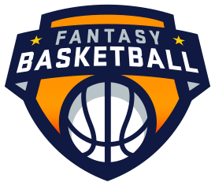

# NBA Fantasy Tool

For this project, we aimed to create a tool to help inform a user’s decisions in an NBA fantasy league. This includes assisting users in drafting the best team on day one, as well as in aiding them with weekly matchups. 

There were many parts to this project. We scraped the statistics we needed from the NBA API and other sources, and then aggregated them in an SQLite database. We wrote machine learning functions in Python to predict 1) the top players relevant to NBA fantasy and 2) the outcome of weekly matchups. Finally, we deployed our flask app to Heroku, which you can check out here: https://nba-fantasy.herokuapp.com/

# Machine Learning

## Fantasy Draft
The players are ranked by z-score, the statistical measure of how a player compares to the overall sample and its distribution. There are around 500 players in the NBA; however only the top 100-200 would be relevant for NBA Fantasy (for example, a 10 team league with 13 man rosters would have 130 players on a roster).

Therefore, a logistic regression model is used to predict the top players of the draft based on previous years’ data. This sample of top players is then used in calculating the z-scores for this year’s draft.

## Head to Head Matchup
A linear regression model is used to predict a player’s stats for the upcoming week of games, based on player’s previous box score and advanced stats, as well as the opposing team stats. For example, a few variables to help predict points would be pace, usage rating and the opposing team’s points allowed.

Stats are then aggregated for all players by fantasy team to predict the outcome of a matchup. Our tool would let the user know which categories are likely wins or losses, as well as which categories are still competitive and could be won with a good pick up off the waiver wire.

